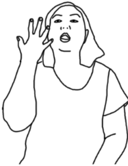
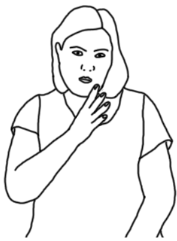
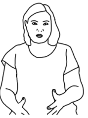
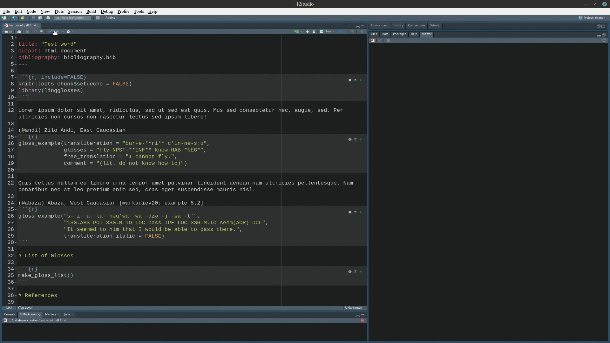

<script src="https://code.iconify.design/2/2.1.0/iconify.min.js"></script>

```{r, include=FALSE}
knitr::knit_engines$set(md = function(options){
  code <- paste(options$code, collapse = '\n')
  knitr::engine_output(options, code, out = NULL)
  })

library(lingglosses)
# in order to have the same list of glosses through the whole document
options("lingglosses.refresh_glosses_list" = FALSE)
```

# Introduction

Abbreviation list is an obligatory part of linguistic articles that nobody reads. These lists contain definitions of abbreviations used in the article (e. g. corpora names or sign language names), but also a list of linguistic glosses --- abbreviations used in linguistic interlinear examples. There is a standardized list of glossing rules [@comrie08] which ends with a list of 84 standard abbreviations. Much bigger list is present on the [Wikipedia page](https://en.wikipedia.org/wiki/List_of_glossing_abbreviations). However researchers can deviate from those lists and provide their own abbreviations.

The worst abbreviation list that I have found in a published article make it clear that there is a room for improvement:

```
NOM = nominative, GEN = nominative, DAT = nominative, ACC = accusative, VOC = accusative, LOC = accusative, INS = accusative, PL = plural, SG = singular
```

Except obvious mistakes in this list there are some more problems that I want to emphasize:

* lack of the alphabetic order;
* there is also some abbreviation (`r add_gloss("SBJV")`, `r add_gloss("IMP")`) in the article that are absent in the abbreviation list.

The main goal of the `lingglosses` R package is to provide an option for creating:

* linguistic glosses for `.html` output of `rmarkdown` [@xie18][^latex];
* semi-automatic compiled abbreviation list.

[^latex]: If you want to render `.pdf` version you can either use latex and multiple linguistic packages developed for it (see e. g. [`gb4e`](https://www.ctan.org/pkg/gb4e), [`langsci`](https://www.ctan.org/pkg/langsci), [`expex`](https://www.ctan.org/pkg/expex), [`philex`](https://www.ctan.org/pkg/philex)), either you can render `.html` first and convert it to `.pdf` afterwards.

You can install the stable version from CRAN:

```{r, eval = FALSE}
install.packages("lingglosses")
```

You can also install the development version of `lingglosses` from [GitHub](https://github.com/agricolamz/lingglosses) with:

```{r, eval=FALSE}
# install.packages("remotes")
remotes::install_github("agricolamz/lingglosses")
```

In order to use the package you need to load it with the `library()` call:

```{r}
library(lingglosses)
```

You can go through examples in this tutorial, but you can also create an lingglosses example from the rmarkdown template (File > New File > R Markdown... > From Template > lingglosses Document).

# Create glossed examples with `gloss_example()`

## Basic usage

The main function of the `lingglosses` package is `gloss_example()`. This package has the following arguments:

* `transliteration`;
* `glosses`;
* `free_translation`;
* `comment`;
* `orthography`[^orth];
* `line_length`.

[^orth]: It is also possible to use this tier for the annotation of words like here:
```{r, echo=FALSE}
gloss_example(transliteration = "eze a za a",
              glosses = "NP PRFX ROOT SFX",
              free_translation = "Eze swept... (Igbo, from [@goldsmith79: 209])",
              orthography = "HL H L H")
```


Except the last one all arguments are self-exploratory. 

```{r}
gloss_example(transliteration = "bur-e-**ri** c'in-ne-sːu",
              glosses = "fly-NPST-**INF** know-HAB-*NEG*",
              free_translation = "I cannot fly. (Zilo Andi, East Caucasian)",
              comment = "(lit. do not know how to)",
              orthography = "Бурери цIиннессу.")
```

In this first example you can see that:

* the transliteration line is italic by default (if you do not want it, just add the `italic_transliteration = FALSE` argument);
* users can use standrad markdown syntax (e. g. `**a**` for **bold** and `*a*` for *italic*);
* the free translation line is framed with quotation marks.

Since function arguments' names are optional in R, users can omit writing them as far as they follow the order of the arguments (you can always find the correct order in `?gloss_example`):

```{r}
gloss_example("bur-e-**ri** c'in-ne-sːu",
              "fly-NPST-**INF** know-HAB-_NEG_",
              "I cannot fly. (Zilo Andi, East Caucasian)",
              "(lit. do not know how to)")
```

It is possible to number and call your examples using strandard `rmarkdown` tool for generating lists `(@)`:

```{md}
(@) my first example
(@) my second example
(@) my third example
```

renders as:

(@) my first example
(@) my second example
(@) my third example

In order to reference examples in the text you need to give them some names:

```{md}
(@my_ex) example for the referencing
```
(@my_ex) example for the referencing

With names settled you can reference example (@my_ex) in the text using the following code `(@my_ex)`.

So this kind of example referencing can be used with `lingglosses` examples like in (@lingglosses1) and (@lingglosses2). The only important details are:

* change your code chunk argument to `echo = FALSE` (or specify it for all code chunks with the following comand in the begining of the document `knitr::opts_chunk$set(echo = FALSE")`);
* do not put an empty line between reference line (with `(@...)`) and the code chunk with `lingglosses` code.

(@lingglosses1)
```{r, echo = FALSE}
gloss_example("bur-e-**ri** c'in-ne-sːu",
              "fly-NPST-**INF** know-HAB-_NEG_",
              "I cannot fly. (Zilo Andi, East Caucasian)",
              "(lit. do not know how to)")
```

(@lingglosses2) Zilo Andi, East Caucasian
```{r, echo = FALSE}
gloss_example("bur-e-**ri** c'in-ne-sːu",
              "fly-NPST-**INF** know-HAB-_NEG_",
              "I cannot fly.",
              "(lit. do not know how to)")
```

Sometimes people gloss morpheme by morpheme (this is especially useful for polysynthetic languages). It is also possible in `lingglosses` (and you can annotate slots with `orthography` argument, see footnote 2 for the details):

(@) Abaza, West Caucasian [@arkadiev20: example 5.2]
```{r}
gloss_example("s- z- á- la- nəq'wa -wa -dzə -j -ɕa -t'",
              "1SG.ABS POT 3SG.N.IO LOC pass IPF LOC 3SG.M.IO seem(AOR) DCL",
              "It seemed to him that I would be able to pass there.")
```

Glossing extraction algorithm implemented in `lingglosses` is case sensitive, so if you want to escape it you can use curly brackets:

(@) Kvankhidatli Andi, [@verhees19: 203]
```{r}
gloss_example("den=no he.ʃː-qi hartʃ'on-k'o w-uʁi w-uk'o.",
              "{I}=ADD DEM.M-INS watch-CVB M-stand.AOR M-be.AOR",
              "And I stood there, watching him.")
```

In the example above `{I}` is just English word *I* that will be escaped and will not appear in the gloss list as *marker of class I*.

## Multiline examples

Sometimes examples are to long and do not fit into the page. In that case you need to add argument `results='asis'` to your chunk and `gloss_example()` will automatically split your example into multiple rows.

(@tsa_ex) Mishlesh Tsakhur, East Caucasian [@maisak07: 386]
```{r, results='asis'}
gloss_example('za-s jaːluʁ **wo-b** **qa-b-ɨ**; turs-ubɨ qal-es-di ǯiqj-eː jaːluʁ-**o-b** **qa-b-ɨ**', 
               '1SG.OBL-DAT shawl.3 AUX-3 PRF-3-bring.PFV woolen_sock-PL NPL.bring-PL-A.OBL place-IN shawl.3-AUX-3 PRF-3-bring.PFV',
               '(they) **brought** me a shawl; instead of (lit. in place of bringing) woolen socks, (they) **brought** a shawl.',
               '(Woolen socks are considered to be more valuable than a shawl.)')
```

If you are not satisfied with the result of automatic split you can change value of the `line_length` argument (the default value is `70`, that means 70 characters of the longest line).

## In-text examples

When an example is small, author may do not want to put it in a separate paragraph, but rather prefer to keep it within the text. It is possible to achieve using standard for `rmarkdown` [inline code](https://rmarkdown.rstudio.com/lesson-4.html). The result of the R code can be inserted into the rmarkdown document by using [backtick symbol](https://en.wikipedia.org/wiki/Grave_accent#Use_in_programming) and small r, for example <code>&grave;r 2+2&grave;</code> will be rendered as `r 2+2`. Currently `lingglosses` can not automatically detect, whether code provided via code chunk or inline. So if you want to use in-text glossed example and want them to appear in the glosses list, it is possible to write them using the `gloss_example()` with the `intext = TRUE` argument. Here is a Turkish example from (@delancey97): `r gloss_example("Kemal gel-miş", "Kemal come-MIR", intext = TRUE)` that was produced with the following inline code:

```{md}
`r gloss_example("Kemal gel-miş", "Kemal come-MIR", intext = TRUE)`
```

In the third section I show how to create a semi-automatic compiled abbreviation list for your document. As an example I provide the abbreviation list for this exact document. Even though the `r add_gloss("MIR")` gloss appears only in this exact section in the in-text example above, it appears in the gloss lists presented in the third section.

## Stand-alone glosses with `add_gloss()`

Sometimes glosses are used in text without any example, e. g. in the table or in the text. So if you want to use in-text glosses and want them to appear in the glosses list, it is possible to write them using the `add_gloss()` function. As an example I adapted part of the verbal inflection paradigm of Andi (East Caucasian) from the Table 2 [@verhees19: 199]:

|                      | `r add_gloss("AFF")` | `r add_gloss("NEG")` |
|----------------------|----------------------|----------------------|
| `r add_gloss("AOR")` | -∅                   | *-sːu*               |
| `r add_gloss("MSD")` | *-r*                 | *-sːu-r*             |
| `r add_gloss("HAB")` | *-do*                | *-do-sːu*            |
| `r add_gloss("FUT")` | *-dja*               | *-do-sːja*           |
| `r add_gloss("INF")` | *-du*                | *-du-sːu*            |
  
that is generated using the folowing markdown[^poortable] code[^tablesgenerator]:

[^poortable]: The table generated with markdown is visualy poor. There is a lot of other ways to generate a table in R: `kable()` from `knitr`; `kableExtra` package, `DT` package and many others.

[^tablesgenerator]: It is easier to generate Markdown or Latex tables with Libre Office or MS Excel and then use some online transformation websites like <https://www.tablesgenerator.com/>.

```{md}
|                      | `r add_gloss("AFF")` | `r add_gloss("NEG")` |
|----------------------|----------------------|----------------------|
| `r add_gloss("AOR")` | -∅                   | *-sːu*               |
| `r add_gloss("MSD")` | *-r*                 | *-sːu-r*             |
| `r add_gloss("HAB")` | *-do*                | *-do-sːu*            |
| `r add_gloss("FUT")` | *-dja*               | *-do-sːja*           |
| `r add_gloss("INF")` | *-du*                | *-du-sːu*            |
```

In the third section I show how to create a semi-automatic compiled abbreviation list for your document. As an example I provide the abbreviation list for this exact document. Even though the `r add_gloss("FUT")` and  `r add_gloss("MSD")` glosses appears only in this exact section in the table above, it appears in the gloss lists presented in the third section.

## Glossing Sign languages

Unfortunately, gloss extraction implemented in `lingglosses` is case sensitive. That makes it hard to use for the Sign Languages glossing, because 

1) Sign linguists used to gloss lexical items with capitalized English translations;
2) Sign language glosses sometimes are splitted into two lines associated with two hands (or even more if you want to account for non-manual markers);
3) Sign language glosses should be somehow aligned with video/pictures (see the fascinating  [signglossR](https://github.com/borstell/signglossR) by Calle Börstell);
4) There can be empty space in glosses;
5) There can be some placeholders that corresponds to utterance by one articulator (e. g. hand), which
are held stationary in the signing space during the articulation made by another articulator.

I will illustrate all this problems with the example from Russian Sign Language [@kimmelman12: 421]:

```{r}
gloss_example(glosses = c("LH: {CHAIR} ________",
                          "RH: {} CL:{SIT}.{ON}"),
              free_translation = "The cat sits on the chair", 
              comment = "[RSL; Eks3–12]",
              drop_transliteration = TRUE)
```

So, first of all the capitalization that is not used for glossing is embraced with curly brackets, so `lingglosses` does not treat it as a gloss. Two separate gloss lines for different hands are provided with a vector with two elements (see `c()` function for the vector creation). It is important to provide the `drop_transliteration = TRUE` argument, otherwise internal tests within the `gloss_example()` function will fail.

It is also possible to use pictures in a transliteration line, see example from Kazakh-Russian Sign Language [@kuznetsova21: 51] (pictures are used with the permission of Anna Kuznetsova, the author):

```{r}
gloss_example("  ",
              c("br_raise_______ {} {}",
                "chin_up_______ {} {}",
                "{WHEN} {MOM} {TIRED}"), 
              "When was mom tired?")
```

The first line corresponds to pictures in markdown format that should be located in the same folder (otherwise you need to specify the path to them, e. g. ``). The next three lines correspond to different lines in the example with some non-manual articulation: as before all glossing lines stored as a vector of strings. User can replace `{}` with `_______` in order to show the scope of non-manual articulation.

# Create semi-automatic compiled abbreviation list

After you finished your text, it is possible to call the `make_gloss_list()` function in order to automatically create a list of abbreviations.

```{r}
make_gloss_list()
```

This function works with the built-in dataset `glosses_df` that is compiled from Leipzig Glosses, [Wikipedia page](https://en.wikipedia.org/wiki/List_of_glossing_abbreviations) and articles from the open access journal [Glossa](https://www.glossa-journal.org/)[^glossa]. Everybody can [download](https://raw.githubusercontent.com/agricolamz/lingglosses/master/database_creation/glosses_extracted.csv) and change this dataset for their own purposes. I will be thankful if you leave your proposals for the dataset change for this list in the [issue tracker](https://github.com/agricolamz/lingglosses/issues) on GitHub. 

[^glossa]: The script for the collecting glosses is available [here](https://github.com/agricolamz/lingglosses/blob/master/database_creation/glossa.R). The glosses list was manually corrected and merged with glosses from other sources. This kind of glosses marked in the `glosses_df` dataset as `lingglosses` in the `source` column.

It is possible that user can be not satisfied with the result of `make_gloss_list()` function, then there are two possible strategies. First strategy is to copy the result of the `make_gloss_list()`, modify it and paste in your `rmarkdown` document. Sometimes you work on some volume dedicated to on group of languages and you want to assure that glosses are the same across all articles, than you can compile your own table with columns `gloss` and `definition` and use it within `make_gloss_list` function. As you can see, all glosses specified in the `my_abbreviations` dataset changed their values in the output below:

```{r}
my_abbreviations <- data.frame(gloss = c("NPST", "HAB", "INF", "NEG"),
                               definition = c("non-past tense", "habitual aspect", "infinitive", "negation marker"))
make_gloss_list(my_abbreviations)
```

Unfortunately, some glosses can have multiple meaning in different traditions (e. g. `r add_gloss("ASS")` can be either associative plural or assertive mood). By default `make_gloss_list()` shows only some entries that were chosen by the package author. You can see all possibilities, if you add argument `all_possible_variants = TRUE`. As you can see, there are multiple possible values for `r add_gloss("AFF")`, `r add_gloss("ASS")`, `r add_gloss("CL")`, `r add_gloss("IMP")`, `r add_gloss("IN")`, `r add_gloss("INS")`, and `r add_gloss("PRF")`:

```{r}
make_gloss_list(all_possible_variants = TRUE)
```

You can notice that problematic glosses (those without definition or duplicated) are colored. This can be switched off adding the argument `annotate_problematic = FALSE`:

```{r}
make_gloss_list(all_possible_variants = TRUE, annotate_problematic = FALSE)
```

In case you want to remove some glosses from the list, you can use argument `remove_glosses`:

```{r}
make_gloss_list(remove_glosses = c("1SG", "3SG"))
```

It is really important that one should not treat results of the `make_gloss_list()` function as carved in stone: once it compiled you can copy, modify and paste it in your document. You can try to spent time improving the output of the function, but on the final stage it is faster to correct it manually.

# Other output formats

Right now there is no direct way of knitting `lingglosses` to `.docx` format, however you can work around copying and pasting from the `.html` version:

```{r, echo = FALSE}

```

The `.pdf` output is possible, however there are some known restrictions: 

* markdown bold and italic annotations do not work;
* example numbers appears above the example;
* there is no non-breaking space in glosses list.

So if you want to avoid those problems the best solution will be to use one of the latex glossing packages listed in the first footnote and the package [`glossaries`](https://www.ctan.org/pkg/glossaries) for automatic compilation of glosses.

# About `glosses_df` dataset

As mentioned above the `make_gloss_list` function's definitions are based on `glosses_df` dataset.

```{r}
str(glosses_df)
```

Most definitions are purposely too general: for example `r add_gloss("ASC")` is defined as `associative`, that can be associative case, associative plural, associative mood, or associated motion. Since user can easily replace the output with their own definitions, it is not a problem for the `lingglosses` package. However, it will make things easier, comparable and reproducible, if linguists would have created unified database of glosses, similar to [concepticon](https://concepticon.clld.org/) [@list21a]. There are several attempts of creating databases or infrastructure for Interlinear-Glossed examples that might be interesting for the reader: 

* [ODIN project](https://odin.linguistlist.org/);
* a Python library [`pyigt`](https://github.com/cldf/pyigt);
* [scription format](https://github.com/digitallinguistics/scription) and [scription2dlx Java-script library](https://github.com/digitallinguistics/scription2dlx).

# References

