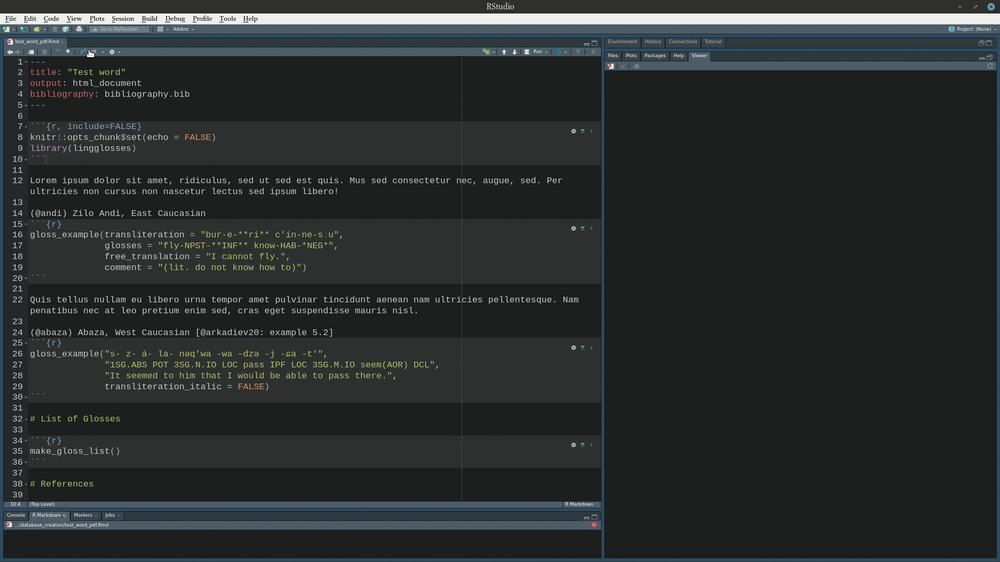

# Introduction

Abbreviation list is an obligatory part of linguistic articles that nobody reads. These lists contain definitions of abbreviations used in the article (e. g. corpora names or sign language names), but also a list of linguistic glosses --- abbreviations used in linguistic interlinear examples. There is a standardized list of glossing rules [@comrie08] which ends with a list of 84 standard abbreviations. Much bigger list is present on the [Wikipedia page](https://en.wikipedia.org/wiki/List_of_glossing_abbreviations). However researchers can deviate from those lists and provide their own abbreviations.

The worst abbreviation list that I have found in a published article make it clear that there is a room for improvement:

```
NOM = nominative, GEN = nominative, DAT = nominative, ACC = accusative, VOC = accusative, LOC = accusative, INS = accusative, PL = plural, SG = singular
```

Except obvious mistakes in this list there are some more problems that I want to emphasize:

* lack of the alphabetic order;
* there is also some abbreviation (<span style="font-variant:small-caps;">sbjv</span>, <span style="font-variant:small-caps;">imp</span>) in the article that are absent in the abbreviation list.

The main goal of the `lingglosses` package is to provide an option for creating:

* linguistic glosses for `.html` output of `rmarkdown` [@xie18][^latex];
* semi-automatic compiled abbreviation list.

[^latex]: If you want to render `.pdf` version you can either use latex and multiple linguistic packages developed for it (see e. g. [`gb4e`](https://www.ctan.org/pkg/gb4e), [`langsci`](https://www.ctan.org/pkg/langsci), [`expex`](https://www.ctan.org/pkg/expex), [`philex`](https://www.ctan.org/pkg/philex)), either you can render `.html` first and convert it to `.pdf` afterwards.

For the moment the package is available only from github, so in order to install it you need to run the following commands:


```r
install.packages("remotes")
remotes::install_github("agricolamz/lingglosses")
```

In order to use the package you need to load it with the `library()` call:


```r
library(lingglosses)
```

# Create glossed examples with `gloss_example()`

The main function of the `lingglosses` package is `gloss_example()`. This package has the following arguments:

* `transliteration`;
* `glosses`;
* `free_translation`;
* `comment`;
* `orthography`[^orth];
* `line_length`.

[^orth]: It is also possible to use this tier for the annotation of words like here:
<table class=" lightable-minimal" style='font-family: "Trebuchet MS", verdana, sans-serif; width: auto !important; border-bottom: 0;'>
<tbody>
  <tr>
   <td style="text-align:left;"> HL </td>
   <td style="text-align:left;"> H </td>
   <td style="text-align:left;"> L </td>
   <td style="text-align:left;"> H </td>
  </tr>
  <tr>
   <td style="text-align:left;"> *eze* </td>
   <td style="text-align:left;"> *a* </td>
   <td style="text-align:left;"> *za* </td>
   <td style="text-align:left;"> *a* </td>
  </tr>
  <tr>
   <td style="text-align:left;"> <span style="font-variant:small-caps;">np</span> </td>
   <td style="text-align:left;"> <span style="font-variant:small-caps;">prfx</span> </td>
   <td style="text-align:left;"> <span style="font-variant:small-caps;">root</span> </td>
   <td style="text-align:left;"> <span style="font-variant:small-caps;">sfx</span> </td>
  </tr>
</tbody>
<tfoot><tr><td style="padding: 0; " colspan="100%">
<sup></sup> 'Eze swept... (Igbo, from [@goldsmith79: 209])'</td></tr></tfoot>
</table>


Except the last one all arguments are self-exploratory. 


```r
gloss_example(transliteration = "bur-e-**ri** c'in-ne-sːu",
              glosses = "fly-NPST-**INF** know-HAB-*NEG*",
              free_translation = "I cannot fly. (Zilo Andi, East Caucasian)",
              comment = "(lit. do not know how to)",
              orthography = "Бурери цIиннессу.")
```

<table class=" lightable-minimal" style='font-family: "Trebuchet MS", verdana, sans-serif; width: auto !important; border-bottom: 0;border-bottom: 0;'>
<tbody>
  <tr>
   <td style="text-align:left;"> Бурери </td>
   <td style="text-align:left;"> цIиннессу. </td>
  </tr>
  <tr>
   <td style="text-align:left;"> *bur-e-**ri*** </td>
   <td style="text-align:left;"> *c'in-ne-sːu* </td>
  </tr>
  <tr>
   <td style="text-align:left;"> fly-<span style="font-variant:small-caps;">npst</span>-<span style="font-variant:small-caps;">**inf**</span> </td>
   <td style="text-align:left;"> know-<span style="font-variant:small-caps;">hab</span>-<span style="font-variant:small-caps;">*neg*</span> </td>
  </tr>
</tbody>
<tfoot><tr><td style="padding: 0; " colspan="100%">
<sup></sup> (lit. do not know how to)</td></tr></tfoot>
<tfoot><tr><td style="padding: 0; " colspan="100%">
<sup></sup> 'I cannot fly. (Zilo Andi, East Caucasian)'</td></tr></tfoot>
</table>

In this first example you can see that:

* the transliteration line is italic by default (if you do not want it, just add the `transliteration_italic = FALSE` argument);
* users can use standrad markdown syntax (e. g. `**a**` for **bold** and `*a*` for *italic*);
* the free translation line is framed with quotation marks.

Since function arguments' names are optional in R, users can omit writing them as far as they follow the order of the arguments (you can always find the correct order in `?gloss_example`):


```r
gloss_example("bur-e-**ri** c'in-ne-sːu",
              "fly-NPST-**INF** know-HAB-_NEG_",
              "I cannot fly. (Zilo Andi, East Caucasian)",
              "(lit. do not know how to)")
```

<table class=" lightable-minimal" style='font-family: "Trebuchet MS", verdana, sans-serif; width: auto !important; border-bottom: 0;border-bottom: 0;'>
<tbody>
  <tr>
   <td style="text-align:left;"> *bur-e-**ri*** </td>
   <td style="text-align:left;"> *c'in-ne-sːu* </td>
  </tr>
  <tr>
   <td style="text-align:left;"> fly-<span style="font-variant:small-caps;">npst</span>-<span style="font-variant:small-caps;">**inf**</span> </td>
   <td style="text-align:left;"> know-<span style="font-variant:small-caps;">hab</span>-<span style="font-variant:small-caps;">_neg_</span> </td>
  </tr>
</tbody>
<tfoot><tr><td style="padding: 0; " colspan="100%">
<sup></sup> (lit. do not know how to)</td></tr></tfoot>
<tfoot><tr><td style="padding: 0; " colspan="100%">
<sup></sup> 'I cannot fly. (Zilo Andi, East Caucasian)'</td></tr></tfoot>
</table>

It is possible to number and call your examples using strandard `rmarkdown` tool for generating lists `(@)`:

```
(@) my first example
(@) my second example
(@) my third example
```

renders as:

(@) my first example
(@) my second example
(@) my third example

In order to reference examples in the text you need to give them some names:

```
(@my_ex) example for the referencing
```
(@my_ex) example for the referencing

With names settled you can reference example (@my_ex) in the text using the following code `(@my_ex)`.

So this kind of example referencing can be used with `lingglosses` examples like in (@lingglosses1) and (@lingglosses2). The only important details are:

* change your code chunk argument to `echo = FALSE` (or specify it for all code chunks with the following comand in the begining of the document `knitr::opts_chunk$set(echo = FALSE")`);
* do not put an empty line between reference line (with `(@...)`) and the code chunk with `linggloses` code.

(@lingglosses1)
<table class=" lightable-minimal" style='font-family: "Trebuchet MS", verdana, sans-serif; width: auto !important; border-bottom: 0;border-bottom: 0;'>
<tbody>
  <tr>
   <td style="text-align:left;"> *bur-e-**ri*** </td>
   <td style="text-align:left;"> *c'in-ne-sːu* </td>
  </tr>
  <tr>
   <td style="text-align:left;"> fly-<span style="font-variant:small-caps;">npst</span>-<span style="font-variant:small-caps;">**inf**</span> </td>
   <td style="text-align:left;"> know-<span style="font-variant:small-caps;">hab</span>-<span style="font-variant:small-caps;">_neg_</span> </td>
  </tr>
</tbody>
<tfoot><tr><td style="padding: 0; " colspan="100%">
<sup></sup> (lit. do not know how to)</td></tr></tfoot>
<tfoot><tr><td style="padding: 0; " colspan="100%">
<sup></sup> 'I cannot fly. (Zilo Andi, East Caucasian)'</td></tr></tfoot>
</table>

(@lingglosses2) Zilo Andi, East Caucasian
<table class=" lightable-minimal" style='font-family: "Trebuchet MS", verdana, sans-serif; width: auto !important; border-bottom: 0;border-bottom: 0;'>
<tbody>
  <tr>
   <td style="text-align:left;"> *bur-e-**ri*** </td>
   <td style="text-align:left;"> *c'in-ne-sːu* </td>
  </tr>
  <tr>
   <td style="text-align:left;"> fly-<span style="font-variant:small-caps;">npst</span>-<span style="font-variant:small-caps;">**inf**</span> </td>
   <td style="text-align:left;"> know-<span style="font-variant:small-caps;">hab</span>-<span style="font-variant:small-caps;">_neg_</span> </td>
  </tr>
</tbody>
<tfoot><tr><td style="padding: 0; " colspan="100%">
<sup></sup> (lit. do not know how to)</td></tr></tfoot>
<tfoot><tr><td style="padding: 0; " colspan="100%">
<sup></sup> 'I cannot fly.'</td></tr></tfoot>
</table>

Sometimes examples are to long and do not fit into the page. In that case you need to add argument `results='asis'` to your chunk and `gloss_example()` will automatically split your example into multiple rows.

(@tsa_ex) Tsakhur: Mishlesh [@maisak07: 386]

```r
gloss_example('za-s jaːluʁ **wo-b** **qa-b-ɨ**; turs-ubɨ qal-es-di ǯiqj-eː jaːluʁ-**o-b** **qa-b-ɨ**', 
               '1SG.OBL-DAT shawl.3 AUX-3 PRF-3-bring.PFV woolen_sock-PL NPL.bring-PL-A.OBL place-IN shawl.3-AUX-3 PRF-3-bring.PFV',
               '(they) **brought** me a shawl; instead of (lit. in place of bringing) woolen socks, (they) **brought** a shawl.',
               '(Woolen socks are considered to be more valuable than a shawl.)')
```

<table class=" lightable-minimal" style='font-family: "Trebuchet MS", verdana, sans-serif; width: auto !important; '>
<tbody>
  <tr>
   <td style="text-align:left;"> *za-s* </td>
   <td style="text-align:left;"> *jaːluʁ* </td>
   <td style="text-align:left;"> ***wo-b*** </td>
   <td style="text-align:left;"> ***qa-b-ɨ**;* </td>
   <td style="text-align:left;"> *turs-ubɨ* </td>
   <td style="text-align:left;"> *qal-es-di* </td>
  </tr>
  <tr>
   <td style="text-align:left;"> <span style="font-variant:small-caps;">1sg</span>.<span style="font-variant:small-caps;">obl</span>-<span style="font-variant:small-caps;">dat</span> </td>
   <td style="text-align:left;"> shawl.<span style="font-variant:small-caps;">3</span> </td>
   <td style="text-align:left;"> <span style="font-variant:small-caps;">aux</span>-<span style="font-variant:small-caps;">3</span> </td>
   <td style="text-align:left;"> <span style="font-variant:small-caps;">prf</span>-<span style="font-variant:small-caps;">3</span>-bring.<span style="font-variant:small-caps;">pfv</span> </td>
   <td style="text-align:left;"> woolen_sock-<span style="font-variant:small-caps;">pl</span> </td>
   <td style="text-align:left;"> <span style="font-variant:small-caps;">npl</span>.bring-<span style="font-variant:small-caps;">pl</span>-<span style="font-variant:small-caps;">a</span>.<span style="font-variant:small-caps;">obl</span> </td>
  </tr>
</tbody>
</table> <table class=" lightable-minimal" style='font-family: "Trebuchet MS", verdana, sans-serif; width: auto !important; border-bottom: 0;border-bottom: 0;'>
<tbody>
  <tr>
   <td style="text-align:left;"> *ǯiqj-eː* </td>
   <td style="text-align:left;"> *jaːluʁ-**o-b*** </td>
   <td style="text-align:left;"> ***qa-b-ɨ*** </td>
  </tr>
  <tr>
   <td style="text-align:left;"> place-<span style="font-variant:small-caps;">in</span> </td>
   <td style="text-align:left;"> shawl.<span style="font-variant:small-caps;">3</span>-<span style="font-variant:small-caps;">aux</span>-<span style="font-variant:small-caps;">3</span> </td>
   <td style="text-align:left;"> <span style="font-variant:small-caps;">prf</span>-<span style="font-variant:small-caps;">3</span>-bring.<span style="font-variant:small-caps;">pfv</span> </td>
  </tr>
</tbody>
<tfoot><tr><td style="padding: 0; " colspan="100%">
<sup></sup> (Woolen socks are considered to be more valuable than a shawl.)</td></tr></tfoot>
<tfoot><tr><td style="padding: 0; " colspan="100%">
<sup></sup> '(they) **brought** me a shawl; instead of (lit. in place of bringing) woolen socks, (they) **brought** a shawl.'</td></tr></tfoot>
</table>

If you are not satisfied with the result of automatic split you can change value of the `line_length` argument (the default value is `70`, that means 70 characters of the longest line).

Sometimes people gloss morpheme by morpheme (this is especially useful for polysynthetic languages). It is also possible in `lingglosses` (and you can annotate slots with `orthography` argument, see footnote 2 for the details):

(@) Abaza, West Caucasian [@arkadiev20: example 5.2]

```r
gloss_example("s- z- á- la- nəq'wa -wa –dzə -j -ɕa -t'",
              "1SG.ABS POT 3SG.N.IO LOC pass IPF LOC 3SG.M.IO seem(AOR) DCL",
              "It seemed to him that I would be able to pass there.")
```

<table class=" lightable-minimal" style='font-family: "Trebuchet MS", verdana, sans-serif; width: auto !important; border-bottom: 0;'>
<tbody>
  <tr>
   <td style="text-align:left;"> *s-* </td>
   <td style="text-align:left;"> *z-* </td>
   <td style="text-align:left;"> *á-* </td>
   <td style="text-align:left;"> *la-* </td>
   <td style="text-align:left;"> *nəq'wa* </td>
   <td style="text-align:left;"> *-wa* </td>
   <td style="text-align:left;"> *–dzə* </td>
   <td style="text-align:left;"> *-j* </td>
   <td style="text-align:left;"> *-ɕa* </td>
   <td style="text-align:left;"> *-t'* </td>
  </tr>
  <tr>
   <td style="text-align:left;"> <span style="font-variant:small-caps;">1sg</span>.<span style="font-variant:small-caps;">abs</span> </td>
   <td style="text-align:left;"> <span style="font-variant:small-caps;">pot</span> </td>
   <td style="text-align:left;"> <span style="font-variant:small-caps;">3sg</span>.<span style="font-variant:small-caps;">n</span>.<span style="font-variant:small-caps;">io</span> </td>
   <td style="text-align:left;"> <span style="font-variant:small-caps;">loc</span> </td>
   <td style="text-align:left;"> pass </td>
   <td style="text-align:left;"> <span style="font-variant:small-caps;">ipf</span> </td>
   <td style="text-align:left;"> <span style="font-variant:small-caps;">loc</span> </td>
   <td style="text-align:left;"> <span style="font-variant:small-caps;">3sg</span>.<span style="font-variant:small-caps;">m</span>.<span style="font-variant:small-caps;">io</span> </td>
   <td style="text-align:left;"> seem(<span style="font-variant:small-caps;">aor</span>) </td>
   <td style="text-align:left;"> <span style="font-variant:small-caps;">dcl</span> </td>
  </tr>
</tbody>
<tfoot><tr><td style="padding: 0; " colspan="100%">
<sup></sup> 'It seemed to him that I would be able to pass there.'</td></tr></tfoot>
</table>


# Create semi-automatic compiled abbreviation list

After you finished your text, it is possible to call the `make_gloss_list()` function in order to automatically create a list of abbreviations.


```r
make_gloss_list()
```

<span style="font-variant:small-caps;">1sg</span> — first person singular; <span style="font-variant:small-caps;">3</span> — third person; <span style="font-variant:small-caps;">3sg</span> — third person singular; <span style="font-variant:small-caps;">a</span> — agent-like argument of canonical transitive verb; <span style="font-variant:small-caps;">abs</span> — absolutive; <span style="font-variant:small-caps;">aor</span> — aorist; <span style="font-variant:small-caps;">aux</span> — auxiliary; <span style="font-variant:small-caps;">dat</span> — dative; <span style="font-variant:small-caps;">dcl</span> — declarative; <span style="font-variant:small-caps;">hab</span> — habitual; <span style="font-variant:small-caps;">in</span> — inessive; <span style="font-variant:small-caps;">inf</span> — infinitive; <span style="font-variant:small-caps;">io</span> — indirect object; <span style="font-variant:small-caps;">ipf</span> — imperfective; <span style="font-variant:small-caps;">loc</span> — locative; <span style="font-variant:small-caps;">m</span> — masculine; <span style="font-variant:small-caps;">n</span> — neuter; <span style="font-variant:small-caps;">neg</span> — negation; <span style="font-variant:small-caps;">npl</span> — ; <span style="font-variant:small-caps;">npst</span> — non-past; <span style="font-variant:small-caps;">obl</span> — oblique; <span style="font-variant:small-caps;">pfv</span> — perfective; <span style="font-variant:small-caps;">pl</span> — plural; <span style="font-variant:small-caps;">pot</span> — potential; <span style="font-variant:small-caps;">prf</span> — perfective; <span style="font-variant:small-caps;">prfx</span> — prefix; <span style="font-variant:small-caps;">root</span> — root; <span style="font-variant:small-caps;">sfx</span> — suffix

This function works with the built-in dataset `glosses_df` that is compiled from Leipzig Glosses, [Wikipedia page](https://en.wikipedia.org/wiki/List_of_glossing_abbreviations) and articles from the open access journal [Glossa](https://www.glossa-journal.org/)[^glossa]. Everybody can change this dataset for their own purposes. 

[^glossa]: The script for the collecting glosses is available [here](https://github.com/agricolamz/lingglosses/blob/master/database_creation/glossa.R). The glosses list was manually corrected and merged with glosses from other sources. This kind of glosses marked in the `glosses_df` dataset as `lingglosses` in the `source` column.

It is possible that user can be not satisfied with the result of `make_gloss_list()` function, then there are two possible strategies. First strategy is to copy the result of the `make_gloss_list()`, modify it and paste in your `rmarkdown` document. Sometimes you work on some volume dedicated to on group of languages and you want to assure that glosses are the same across all articles, than you can compile your own table with columns `gloss` and `definition` and use it within `make_gloss_list` function.


```r
my_abbreviations <- data.frame(gloss = c("NPST", "HAB", "INF", "NEG"),
                               definition = c("non-past tense", "habitual aspect", "infinitive", "negation marker"))
make_gloss_list(my_abbreviations)
```

<span style="font-variant:small-caps;">1sg</span> — first person singular; <span style="font-variant:small-caps;">3</span> — third person; <span style="font-variant:small-caps;">3sg</span> — third person singular; <span style="font-variant:small-caps;">a</span> — agent-like argument of canonical transitive verb; <span style="font-variant:small-caps;">abs</span> — absolutive; <span style="font-variant:small-caps;">aor</span> — aorist; <span style="font-variant:small-caps;">aux</span> — auxiliary; <span style="font-variant:small-caps;">dat</span> — dative; <span style="font-variant:small-caps;">dcl</span> — declarative; <span style="font-variant:small-caps;">hab</span> — habitual aspect; <span style="font-variant:small-caps;">in</span> — inessive; <span style="font-variant:small-caps;">inf</span> — infinitive; <span style="font-variant:small-caps;">io</span> — indirect object; <span style="font-variant:small-caps;">ipf</span> — imperfective; <span style="font-variant:small-caps;">loc</span> — locative; <span style="font-variant:small-caps;">m</span> — masculine; <span style="font-variant:small-caps;">n</span> — neuter; <span style="font-variant:small-caps;">neg</span> — negation marker; <span style="font-variant:small-caps;">npl</span> — ; <span style="font-variant:small-caps;">npst</span> — non-past tense; <span style="font-variant:small-caps;">obl</span> — oblique; <span style="font-variant:small-caps;">pfv</span> — perfective; <span style="font-variant:small-caps;">pl</span> — plural; <span style="font-variant:small-caps;">pot</span> — potential; <span style="font-variant:small-caps;">prf</span> — perfect; <span style="font-variant:small-caps;">prfx</span> — prefix; <span style="font-variant:small-caps;">root</span> — root; <span style="font-variant:small-caps;">sfx</span> — suffix

As you can see all glosses specified in the `my_abbreviations` dataset changed their values in the output. Unfortunately, some glosses can have multiple meaning in different traditions (e. g. <span style="font-variant:small-caps;">ass</span> can be either associative plural or assertive mood). By default `make_gloss_list()` shows only some entries that were chosen by the package author. You can see all possibilities, if you add argument `all_possible_variants = TRUE`:


```r
make_gloss_list(all_possible_variants = TRUE)
```

<span style="font-variant:small-caps;">1sg</span> — first person singular; <span style="font-variant:small-caps;">3</span> — third person; <span style="font-variant:small-caps;">3sg</span> — third person singular; <span style="font-variant:small-caps;">a</span> — agent-like argument of canonical transitive verb; <span style="font-variant:small-caps;">abs</span> — absolutive; <span style="font-variant:small-caps;">aor</span> — aorist; <span style="font-variant:small-caps;">aux</span> — auxiliary; <span style="font-variant:small-caps;">dat</span> — dative; <span style="font-variant:small-caps;">dcl</span> — declarative; <span style="font-variant:small-caps;">hab</span> — habitual; <span style="font-variant:small-caps;">in</span> — inessive; <span style="font-variant:small-caps;">inf</span> — infinitive; <span style="font-variant:small-caps;">io</span> — indirect object; <span style="font-variant:small-caps;">ipf</span> — imperfective; <span style="font-variant:small-caps;">loc</span> — locative; <span style="font-variant:small-caps;">m</span> — masculine; <span style="font-variant:small-caps;">n</span> — neuter; <span style="font-variant:small-caps;">neg</span> — negation; <span style="font-variant:small-caps;">npl</span> — ; <span style="font-variant:small-caps;">npst</span> — non-past; <span style="font-variant:small-caps;">obl</span> — oblique; <span style="font-variant:small-caps;">pfv</span> — perfective; <span style="font-variant:small-caps;">pl</span> — plural; <span style="font-variant:small-caps;">pot</span> — potential; <span style="font-variant:small-caps;">prf</span> — perfective; <span style="font-variant:small-caps;">prf</span> — perfective; <span style="font-variant:small-caps;">prfx</span> — prefix; <span style="font-variant:small-caps;">root</span> — root; <span style="font-variant:small-caps;">sfx</span> — suffix

As you can see there are two possible values for <span style="font-variant:small-caps;">prf</span> that are listed above.

# Other output formats

Right now there is no direct way of knitting `lingglosses` to `.docx` format, however you can work around copying and pasting from the `.html` version:

<!-- -->

The `.pdf` output is possible, however there are some known restrictions: 

* markdown bold and italic annotations do not work;
* example numbers appears above the example;
* there is no non-breaking space in glosses list.

So if you want to avoid those problems the best solution will be to use one of the latex glossing packages listed in the first footnote and the package [`glossaries`](https://www.ctan.org/pkg/glossaries) for automatic compilation of glosses.

# References

